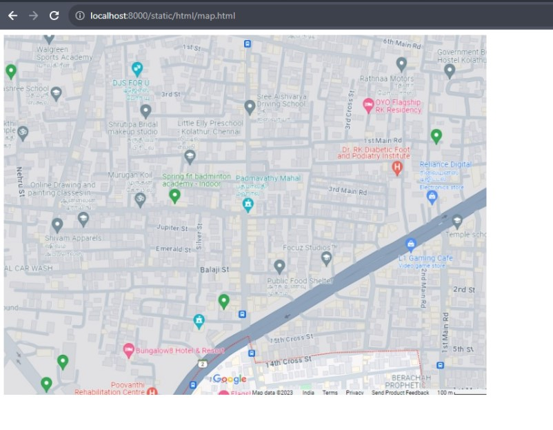

# Places Around Me
## AIM:
To develop a website to display details about the places around my house.

## Design Steps:

### Step 1:
create a ex04 and clone the repository places-around-me from github. then using create myproj django-admin startproject , after the using the activating django. by using the code conda activate djangowt.
### Step 2:
change the directory to myproj. then create a file named static, after this do the changes in settings.py by adding import os, then allowed host by using "*" and add the code STATICFILES_DIR for making a link between the vs code and os by using the code os.path.join(BASE_DIR,'static').
### Step 3:
change the directory to static. then create the map.html using touch in git bash. then add the places in the places in the file using imagemap.org to set the coordinates. then add image and information to the image added. run the code in the localhost

## Code:
map.html
```html
<!DOCTYPE html>
<html>
    <head>
        <title>
            IMAGEMAPS DEMO
        </title>
    </head>
    <body>
        
        <map name="image_map">
            <area alt="murugankovil" title="murugankovil" href="murugankovil.html" coords="199,247,26" shape="circle">
            <area alt="shivam" title="shivam" href="shivam.html" coords="71,298,134,337" shape="rect">
            <area alt="l1gaming" title="l1gaming" href="l1gaming.html" coords="624,332,43" shape="circle">
            <area alt="ratnamotor" title="ratnamotor" href="ratnamotor.html" coords="601,44,650,90" shape="rect">
            <area alt="focuzstudio" title="focuzstudio" href="focuzstudio.html" coords="486,331,36" shape="circle">
        </map>
    </body>
</html>
```
focuzstudio.html
```html
<!DOCTYPE html>
<html>
<head>
    <title>focuzstudio</title>
</head>
<body bgcolor="yellow">
   <h1 align="center">FOCUZ STUDIO</h1>
   
   <p>
    address : 39, Second Floor, 2nd St, Thirumalai Nagar, Kolathur, Chennai, Tamil Nadu 600099
    ABOUT US
    we are a hyper-enthusiastic bunch of obsessively passionate people who are constantly listening with our eyes. 
    We believe and surrender to the power of a good photograph.
    Great photography comes from that special moment when beautiful light, a unique location, and dynamic composition all combine to capture and create emotion.
    The emotion may be the raw determination of a swimmer lunging to touch the wall,  the laughter of a small child as she plays with a sibling, or that special feeling you have as you witness a once in a lifetime occasion. 
    Whether photographing athletes for a specialty publication, or shooting a family photo session, this is my goal as a professional photographer, to capture those emotions, to record those moments, and preserve those memories forever.
   </p>
</body>
</html>

```

l1gaming.html
```html
<!DOCTYPE html>
<html>
<head>
    <title>l1gaming</title>

</head>

<body bgcolor="cyan">
   <h1 align="center">L1 GAMING</h1>
   
   <p>
    address: No:80 5th Street, 100 Feet Rd, Thillaiganga Nagar, Kolathur, Chennai, Tamil Nadu 600099
    a small business resembling an Internet cafe but with an emphasis on computer games. 
    Games are often networked and visitors can play against each other.
    For more information and articles, see the Business Resource channel and the Finance channel.
    Gaming cafes is meant for people to play latest games. 
    They have all the latest hardware consoles. play all sought of latest games. 
    There are people in India who cannot afford such HI-end hardware so the best place to enjoy playing games
   </p> 
</body>
</html>
```
murugankovil.html

```html
<!DOCTYPE html>
<html>
<head>
    <title>murugankovil</title>
</head>
<body bgcolor="green">
    
    <h1> MURUGAN KOVIL</h1>
    
    <p>
    address : Murugan Kovil St, Kolathur, Chennai, Tamil Nadu 600099
    Murugan Kovil, also known as Murugan Temple, holds a special place in the hearts of millions of devotees worldwide. Dedicated to Lord Murugan, the Hindu deity revered as the God of War and Victory, these temples are often vibrant centers of spirituality, cultural celebration, and communal gatherings.
    The significance of Murugan Kovil lies deeply rooted in Hindu mythology and tradition. 
    Lord Murugan, the son of Lord Shiva and Goddess Parvati, is believed to represent valor, bravery, and wisdom. 
    His presence is thought to bring protection and guidance to his devotees, especially during challenging times.
    Worshipers flock to these temples seeking blessings for success, courage, and the strength to overcome obstacles in life's journey.
    </p> 
</body>
</html>
```
ratnamotor.html
```html
<!DOCTYPE html>
<html>
<head>
    <title>ratnamotor</title>
</head>
<body bgcolor="plum">
   <h1 align="center"> RATNA MOTOR </h1>
   
   <p>
    The motor shop near your house is a bustling hub for all things related to motors and automotive needs. 
    Situated conveniently in the heart of the neighborhood, it's a haven for car enthusiasts, DIY mechanics, and anyone seeking motor-related services.
    The shop's exterior boasts a classic yet modern facade, with large windows showcasing some of their latest products and services. 
    The sign above the entrance proudly displays the shop's name in bold, vibrant letters, making it easily recognizable from a distance.

   </p> 
</body>
</html>
```
shivam.html

```html
<!DOCTYPE html>
<html>
<head>
    <title>shivam</title>
</head>
<body bgcolor="cyan">
   <h1>SHIVAM APPARELS</h1> 
   
   <p>
    Address: No-35, Murugan Koil Street, Varasakthi Nagar, Annex, Kolathur, Chennai, Tamil Nadu 600050
    We are a leading Leather Garments Manufacturer and Exporter in Chennai, India, manufacturing leather garments in varied styles and designs. 
    At Shivam Apparels we manufacture leather garments using the best state of art, professional technology and expertise from professionals in the field of leather design and technology.
    Our garments are exported to Europe, the USA and Canada.
   </p>
</body>
</html>
```

## Output:



## Result:
this program executed successfully 